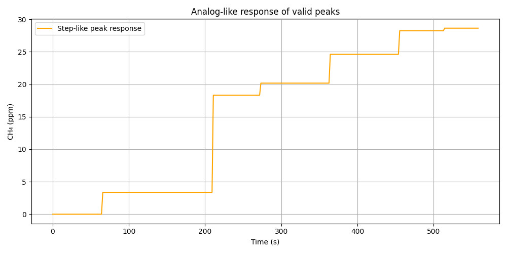
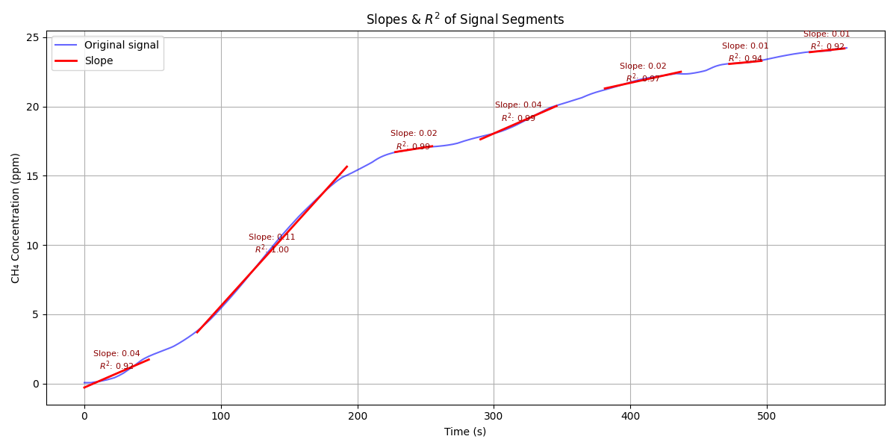

CH₄ Signal Processor
====================

This project provides a tool to process CH₄ (methane) concentration data from `.txt` files, apply advanced filtering and peak correction, and export cleaned `.txt` files along with visualizations.

📁 Project Contents
-------------------

    📦 CH4 Signal Processor
    ├── main.py                # Main CLI entry point
    ├── inc/functions.py       # Processing logic
    ├── Raw data/              # Input .txt files
    ├── Processed data/        # Output .txt and plots
    # Output .txt and plots
    ├── results/               # Text reports for flux and bubble analysis
    └── plots/                 # All output figures (processed signal, steps, slopes)
    ├── build_exe.bat          # Script to build .exe using PyInstaller
    ├── requirements.txt       # Python dependencies
    └── README.md              # Project documentation

🧰 Requirements
---------------

- Python ≥ 3.8
- pip (Python package manager)

> To build the `.exe`, PyInstaller must be installed (automatically handled by the `.bat` script).

🪟 How to Use on Windows
------------------------

🔹 Option 1 – Use the `.exe`

After compilation, simply double-click `CH4Processor.exe` located in the `dist/` folder, or run it from the terminal:

    CH4Processor.exe

You’ll be prompted to choose whether to process a specific file or all `.txt` files in the `Raw data/` folder.  
The processed data will be saved in `Processed data/` folder.

🔹 Option 2 – Compile the `.exe` with `build_exe.bat`

To generate the executable from source:

1. Install Python from https://www.python.org and make sure to check "Add to PATH"
2. Open the project folder
3. Double-click `build_exe.bat`
   (or run it from terminal: `.build_exe.bat`)

This will create the executable at `CH4Processor.exe`.  
It expects the `Raw data/` folder to be at the same level as `CH4Processor.exe`.

🐧🍏 How to Use on Linux/OS
---------------------------

    pip install -r requirements.txt  # for install python dependencies
    python main.py                   # for direct Python usage

🧪 Usage Instructions
---------------------

Run from the terminal (depending on version used):

    python main.py                   # for direct Python usage
    CH4Processor.exe                 # for the compiled executable

The tool will:

- Load `.txt` files from `Raw data/` folder
- Apply signal filtering and peak correction ('CH4Processor.exe')
- Save processed `.txt` results and plots to the `Processed data/` folder:
  - Export a numerical summary of diffusive fluxes and ebullitive events into a `.txt` file inside `Processed data/results/`.
  - Save the final processed data files in `.csv` format inside `Processed data/data/`.
  - Save the following plots in `Processed data/plots/`:
      • Original vs Processed Signal with Detected Peaks
      • Analog-like Step Signal of Valid Peaks
      • Linear Fits on Diffusive Segments (with slopes and R²)


📊 Example Outputs
------------------

You can preview expected outputs below or by opening the `example_outputs/` folder:

### Detected Peaks Overlay


### Step-like Peak Response


### Linear Fits on Diffusive Segments


---


You will also find a text summary file:
- `example_results.txt`: numerical summary of diffusive and ebullitive analysis

### Summary of Numerical Results
📄 Numerical Results Summary  
You can open the full text file at `example_outputs/example_results.txt`.

Example contents:

```
# Source File: 30062024_1400_LAKE1

--- Diffusive Flux Segments ---
- Slope: 0.0427 ppm/s | R²: 0.923 | T: 23.0°C | P: 610.0 mmHg | Diffusive Flux: 1016.07 µmol/m²·h
- Slope: 0.1091 ppm/s | R²: 0.997 | T: 24.7°C | P: 610.0 mmHg | Diffusive Flux: 2578.50 µmol/m²·h
- Slope: 0.0155 ppm/s | R²: 0.990 | T: 26.1°C | P: 610.0 mmHg | Diffusive Flux: 365.23 µmol/m²·h
- Slope: 0.0432 ppm/s | R²: 0.987 | T: 26.2°C | P: 610.0 mmHg | Diffusive Flux: 1016.65 µmol/m²·h
- Slope: 0.0217 ppm/s | R²: 0.970 | T: 26.6°C | P: 610.0 mmHg | Diffusive Flux: 509.01 µmol/m²·h
- Slope: 0.0093 ppm/s | R²: 0.939 | T: 26.6°C | P: 610.0 mmHg | Diffusive Flux: 218.17 µmol/m²·h
- Slope: 0.0106 ppm/s | R²: 0.917 | T: 26.2°C | P: 610.0 mmHg | Diffusive Flux: 249.16 µmol/m²·h

--- Summary Statistics of Diffusive Fluxes (µmol/m²·h) ---
count       7.00
mean      850.40
std       832.12
min       218.17
25%       307.20
50%       509.01
75%     1,016.36
max     2,578.50
dtype: float64

--- Summary of Ebullitive Events ---
Peak Analysis Interval: 10
Total Adjusted CH₄ Concentration (ppm): 6.48
Final CH₄ Concentration (ppm): 33.49
Contribution of boiling to the total (%): 19.34
Number of Bubbles: 6
Index of Bubbles: [39, 125, 162, 216, 270, 305]
Total Bubble Time (h): 0.028
Bubbles per Hour: 213.4
```

🧼 Notes
--------

- The executable expects the raw_data/ and Processed data/ folders to be located in the same directory as CH4Processor.exe
- A .gitignore file is included to avoid tracking generated files and build artifacts


